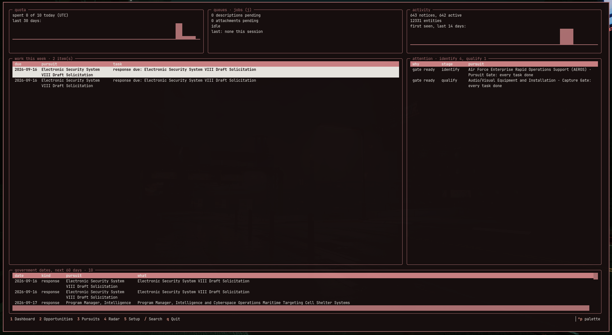
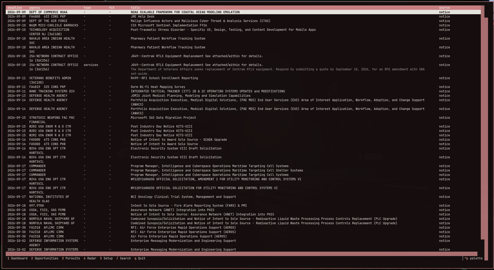
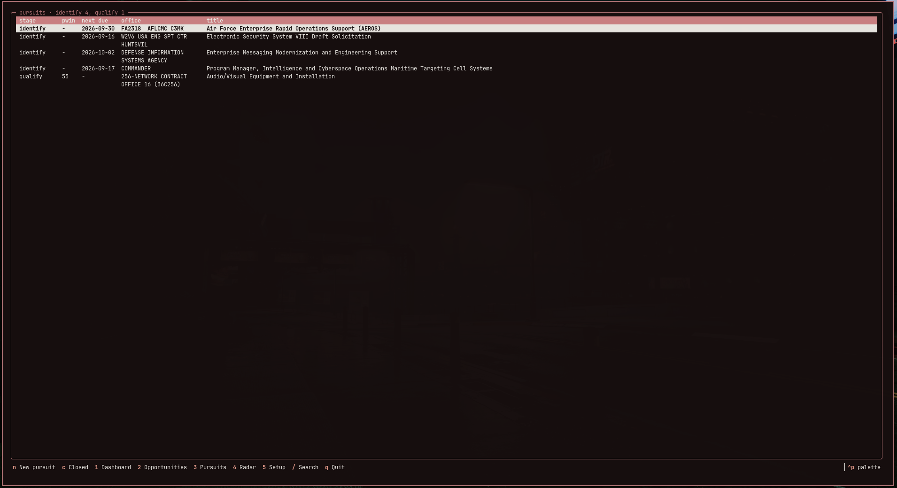
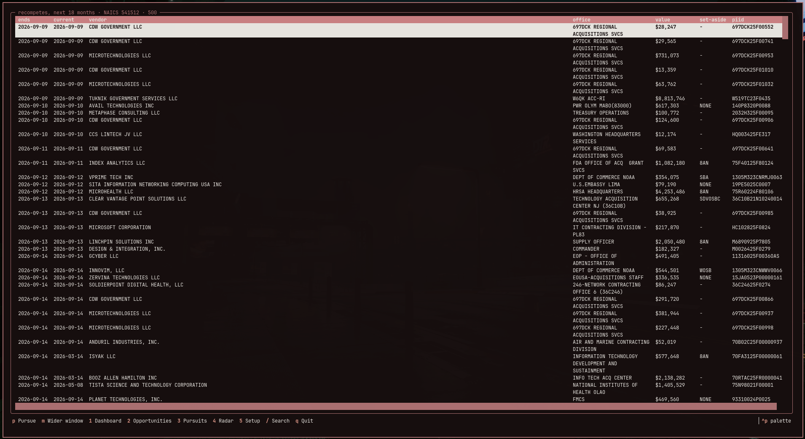
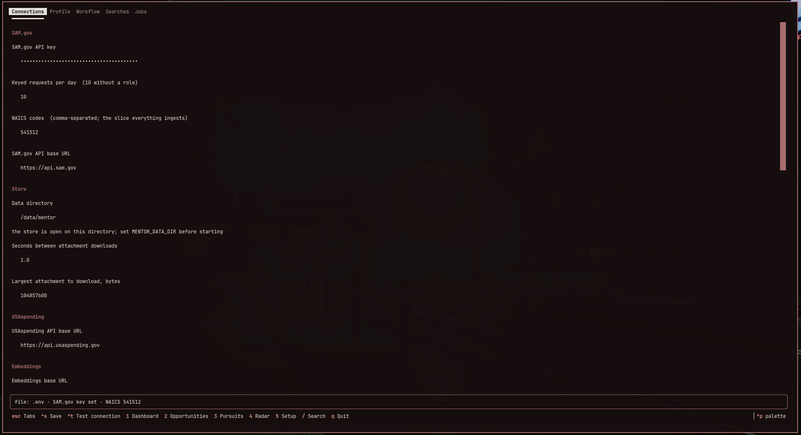
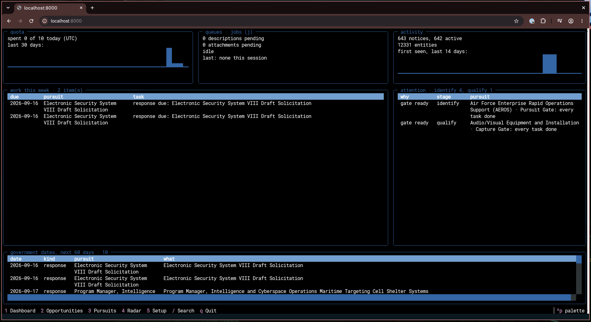

# orrery

Free, open source, self-hosted business development intelligence for U.S. federal government contracting.

An orrery is a clockwork model of a system too large to see at once, built so the parts can be watched moving in relation to each other. That is the ambition: agencies, offices, contractors, contracts and the opportunities between them, in one model you run yourself.




## Status

Early, and usable today. The primary interface is `orrery top`, a full-screen
terminal UI; every command also runs from the shell and prints `--json`. It
installs from source or with `docker compose`, and runs with no SAM.gov account
at all (see [Before you start](#before-you-start)).

**Working now**

- **Ingest** — a NAICS slice of SAM.gov notices (codes you list, matched by
  prefix, so `5415` takes the whole industry group), from the daily bulk extract or
  the API, with their attachments; three years of USAspending award history;
  and SAM.gov entity registrations.
- **Search** — full text across notice descriptions and the text extracted from
  PDF, Word and spreadsheet attachments, by keyword or by meaning through an
  embedding endpoint you choose.
- **Context** — a notice's page carries the agency chain, the incumbent, the
  office's recent awards in the same NAICS, the government contacts named on
  it, and the documents. Every vendor is an entity with its registration on
  record.
- **Pursuits** — a requirement you intend to win moves through your own gated
  stages (streamlined Shipley by default, editable) by recorded decisions. The
  dashboard shows this week's work on your calendar rather than the
  government's, and the recompete radar surfaces requirements from the award
  history months before any notice.
- **AI you choose** — a fast model writes a two-sentence summary, a work type,
  keywords, and the set-aside the text states for every fetched notice; a deep
  model assesses a pursuit against your company profile, a versioned TOML
  document. Both are stored with their provenance.
- **Interfaces** — the terminal UI, the CLI, an MCP server so an agent can work
  over the store, and versioned read-only `v_*` SQL views for your own
  dashboards. Setup and every operation run inside the app.

**Not there yet**

- Officials and organizations beyond the contacts named on a notice
- Budget context
- The resolver that merges the duplicate offices the bulk extract creates

The design lives in [`docs/DESIGN.md`](docs/DESIGN.md); §9 is the order of work.
The probe notes in [`docs/notes/`](docs/notes/) record what was checked live
against each government API, and when — the endpoints these adapters rest on are
largely undocumented.


## Why

Federal opportunity, award, and spending data is public. The tools that make it useful are priced for enterprise budgets, well beyond the reach of the small businesses that make up most of the market and that the government's own set-aside programs exist to serve.

orrery is free to self-host, free of telemetry, and community-owned. A free, self-hosted alternative is structurally hard to answer without giving up that pricing.

The ambition is larger than a better search over solicitations. orrery is built on an entity graph of agencies, offices, contractors, contracts, and officials, onto which opportunity data, award history, entity registrations, budgets, and the user's own company profile are all resolved, with every fact carrying its source. The product is the context view over that graph: an opportunity page that already knows the incumbent, the contract history, the contracting officer's other awards, and the agency's budget line.

## Principles

- **Shipped code stays free and forkable.** Guaranteed by a permissive license, not by a pricing page.
- **Self-hostable by design.** One `docker compose` command on a home server or a cheap
  cloud box — `run` today, `up` once the ingestion daemon makes a long-running service.
- **Zero telemetry.** The software phones home to nobody.
- **Bring your own keys.** You supply your own SAM.gov API key and LLM credentials; the project never touches credentials, billing, or inference costs.
- **Model-agnostic AI.** Every AI feature talks to a configurable OpenAI-compatible endpoint, local or cloud, your choice.
- **No hosted service in v1.** No accounts, no uptime obligation.
- **Public data and public knowledge only.** Proprietary capture intelligence and any organization's internal process never enter the repository.
- **People appear only in their official public capacity,** from government sources. No scraping of personal social media, no profiling beyond the public role.
- **Every fact carries provenance.** Source, observation time, and confidence, or it is not stored.

## What v1 will do

SAM.gov already offers keyword search and email alerts over notice metadata. What it cannot do is search inside the attached solicitation documents, where the statements of work, Section L/M instructions, and amendments live. v1 does exactly that for a NAICS slice you choose — the codes you list, matched by prefix against the code the government put on the notice — within the SAM.gov API quota: ingest notices, fetch and extract their attachments, and offer full-text and semantic search across all of it. On top of that: saved searches, an opportunity pipeline with PWin history, your company profile, a full-screen terminal UI that also runs in a browser tab, and an MCP server so any AI agent can work over the store. The terminal UI is the primary interface, in the idiom of system monitors like btop. Every command also prints JSON, and the database exposes stable read-only views, so your own dashboards are a first-class way to use it; Datasette over the database file gives a point-and-click browser for free.

v1 deliberately does not include a hosted service, accounts, telemetry, third-party plugins, a bespoke web UI, a wholesale mirror of SAM.gov, or enrichment sources beyond SAM.gov. The graph tables exist from the first migration; the adapters that fill them from other sources come after. GSA eBuy is a known gap: its requests for quote are visible only to Multiple Award Schedule holders inside a logged-in session, and orrery will not hold a login for a third-party portal, so eBuy waits on a public API or an export you can hand it.

## Before you start

**Nothing.** orrery runs with no SAM.gov account and no credentials of any kind. The daily bulk extract is a public file carrying every active contract opportunity with its description, and a notice's attachments are listed and downloaded from public URLs that take no key. `orrery ingest bulk` followed by `orrery fetch` gives you a working store with full-text search inside the solicitation documents.

**A SAM.gov API key (optional)** buys same-day notices and the API's own notice descriptions. Measured over one NAICS slice on 2026-09-09, every notice posted before the current day was already in the bulk extract; what a key closes is latency, not coverage. Request one from your SAM.gov account profile.

A personal key is limited to roughly 10 requests per day. A key backed by a role on an active entity registration gets roughly 1,000 — but that registration requires a business and can take up to 10 business days, and this project is for individuals as much as for companies, so nothing is designed around having one. Each search page and each notice description is one request; attachment manifests and the files themselves use no key and do not count.

Every setting below can be entered in the app (`orrery top`, key `5`), which also tests each connection with the smallest possible request (`ctrl+t`): one keyed one-day SAM.gov search page, one embedding of the word "orrery", one tiny structured completion from a chat model.

**An embedding endpoint** (optional; needed only for `orrery embed` and `orrery search --semantic`). Any OpenAI-compatible `/embeddings` endpoint works. The default is a local [Ollama](https://ollama.com): install it, run `ollama pull nomic-embed-text`, and the defaults (`ORRERY_EMBED_BASE_URL=http://localhost:11434/v1`, `ORRERY_EMBED_MODEL=nomic-embed-text`, no key) already point at it. For a cloud endpoint set the base URL, the model name, and `ORRERY_EMBED_API_KEY`.

**A chat model** (optional; needed only for `orrery pursuit assess`). Two slots, `fast` for grunt work and `deep` for judgment, each any OpenAI-compatible endpoint (Ollama, LM Studio, llama.cpp, vLLM, OpenAI, OpenRouter) or Anthropic through its official SDK, set with `ORRERY_AI_FAST_*` and `ORRERY_AI_DEEP_*`. The default is a local Ollama running `qwen3:14b` (`ollama pull qwen3:14b`); run Ollama with `OLLAMA_CONTEXT_LENGTH=16384` or more, because its default context of 4,096 tokens silently truncates a long prompt from the front. Leave the deep slot unset to use the fast one for everything, or point it at `claude-opus-5` with `ORRERY_AI_DEEP_PROVIDER=anthropic` and a key in `ORRERY_AI_DEEP_API_KEY` or `ANTHROPIC_API_KEY` — that one provider needs a vendor SDK, shipped as an optional extra (`uv sync --extra anthropic`); every OpenAI-compatible endpoint is reached over plain HTTP with nothing extra to install. On Arch with an AMD GPU, the `ollama-rocm` package is the one that uses the card; the plain `ollama` package runs on the CPU.

What leaves your machine: `orrery ingest bulk` downloads a public file from `sam.gov` and sends no key. `orrery fetch` asks `sam.gov` for each notice's attachment list and downloads the files, both without a key, and sends your key to `api.sam.gov` only for notice descriptions. `orrery ingest awards` sends only its filter (your NAICS codes and a date window) to `api.usaspending.gov` and downloads the prepared file from `files.usaspending.gov`, with no key. `orrery ingest entities` sends your SAM.gov key to `api.sam.gov` like every other keyed command, and `--uei` sends the UEIs you name. `orrery embed` sends the text of your ingested notices and attachments (public SAM.gov data) to that endpoint, and `orrery search --semantic` sends your query text, which may reveal what you are pursuing. With the local default nothing leaves the machine. Nothing is ever sent anywhere else. `orrery pursuit assess` sends your profile document, the pursuit's summary and notes, and public notice and attachment text to the chat model you configured, and nothing else; `orrery summarize` sends each notice's public title, typed fields, and description to the fast model, and never your profile. With the local default nothing leaves the machine.

## Quickstart

Setup happens inside the app. On first run it opens on its Connections tab; enter the NAICS codes you want (and a SAM.gov key if you have one, see [Before you start](#before-you-start)), press `ctrl+s`, and the app writes `.env` next to it (mode 0600, only `ORRERY_*` lines, never logged). Every operation below then runs from the Jobs tab (`j`) with a log, and every setting, your profile, your workflow, and your saved searches are forms under `5`. The CLI is the same engine for scripts and cron; if you would rather start from a file, copy `.env.example` to `.env` and fill it in.

### From source

Requires Python 3.13 and uv; `mise install` provides both from `.mise.toml`.

```
uv sync
uv run orrery top                 # first run: Connections tab, then j for the jobs below
```

The same operations from a shell:

```
uv run orrery ingest notices      # optional, needs a key: yesterday's notices, one request per page
uv run orrery ingest bulk         # start here: today's full extract (~250 MB, no key, no quota), your slice only
uv run orrery ingest awards       # three years of USAspending award history for your slice (no key, no quota)
uv run orrery ingest entities     # optional, needs a key: SAM.gov registrations (one request per month)
uv run orrery fetch --dry-run     # what would be fetched, and today's remaining budget
uv run orrery fetch               # attachment manifests and files (no key); descriptions too if you have one
uv run orrery extract             # text from PDF, Word and Excel attachments; no quota
uv run orrery embed               # optional: chunk and embed via your endpoint
uv run orrery summarize           # optional: a summary and tags per notice from the fast model
uv run orrery search "statement of work"
uv run orrery search --semantic "on-site help desk staffing"
uv run orrery quota
```

### With Docker

The image is built from the repository's own `Dockerfile`, which installs only what `uv.lock` pins. Building fetches the `python:3.13-slim` base image and the locked packages from PyPI, nothing else. There is no daemon yet, so each command runs in a throwaway container; `docker compose up` is not the verb.

```
mkdir -p data                     # mounted at /data inside the container
touch .env                        # mounted at /app/.env; the app writes it (a missing file would mount as a directory)
docker compose build
docker compose run --rm orrery top
```

The same operations from a shell:

```
docker compose run --rm orrery ingest notices
docker compose run --rm orrery ingest bulk
docker compose run --rm orrery ingest awards
docker compose run --rm orrery ingest entities
docker compose run --rm orrery fetch --dry-run
docker compose run --rm orrery fetch
docker compose run --rm orrery extract
docker compose run --rm orrery embed
docker compose run --rm orrery summarize
docker compose run --rm orrery search "statement of work"
docker compose run --rm orrery search --semantic "on-site help desk staffing"
docker compose run --rm orrery quota
```

The container runs as uid 1000. If your user has a different uid, run `sudo chown 1000 data .env` once, or add `--user "$(id -u):$(id -g)"` to each `run`. The `data` directory is the whole store (`orrery.sqlite` plus `attachments/`), and the same directory works from source and from the container. `.env` is bind-mounted rather than injected as environment variables so the app can write it; `ORRERY_DATA_DIR` is the one real environment variable in the container, and the app shows it locked. An Ollama running on the host is reachable from the container as `host.docker.internal`; set `ORRERY_EMBED_BASE_URL=http://host.docker.internal:11434/v1` in `.env`.

`orrery sync` runs the whole loop in order — `ingest bulk`, `fetch`, `extract`,
`summarize`, `embed` — and is the one command to put in a cron entry or press
in the Jobs tab. Every stage is resumable and idempotent, so a run interrupted
part way is continued by the next one, and a stage with nothing to do costs
nothing. It stops nothing when today's SAM.gov budget is spent: the stages that
follow the keyed one need no key, so they run, and descriptions resume tomorrow.
`--no-ai` drops `summarize` and `embed`, the two stages that reach a model.

The three ingest commands, and what each costs against the SAM.gov quota:

| Command | Source | Quota |
|---|---|---|
| `orrery ingest bulk` | The daily SAM.gov extract, downloaded once per day into `data/extracts/`, keeping only notices whose NAICS code begins with one of yours and filling in descriptions the API has not fetched. `--archived 2025` ingests a fiscal year's archive for history. | None |
| `orrery ingest awards` | Every USAspending contract action under your NAICS codes, matched by prefix there too, over the last three years (`--since` and `--until` change the window). Waits the few minutes the service takes to prepare the file, downloads it into `data/extracts/usaspending/`, and stores one row per award with its awarding office, vendor, value, dates, and solicitation number. | None |
| `orrery ingest entities` | SAM.gov's public monthly entity extract — one keyed request for every registrant in the country, about 150 MB — into `data/extracts/sam/`. `--uei A,B` looks up a few registrants through the Entity Management API instead, ten per keyed request. | Counts against the daily budget |

Vendors become contractor entities keyed by UEI. Awards resolve to offices
already in the store by office code, and what cannot resolve is queued as an
unresolved alias rather than guessed. From the entity extract orrery keeps only
the registrants the store cares about — vendors seen in awards, registrants
whose primary NAICS is one of yours, and your own company — each with its
registration status, expiry, structure, business and SBA types, NAICS and PSC
lists, and address as sourced facts. Registrant contacts are never stored.

Every command that prints data takes `--json`. `orrery --help` and
`orrery <command> --help` list the rest.

### Working pursuits

Everything here has a form in the app: the profile, the workflow, and saved searches are tabs under `5`, and a pursuit's screen carries its tasks, gates, and `s` to assess it. The CLI equivalents:

```
uv run orrery profile edit                  # your company as a TOML document, in $EDITOR; every save is a version
uv run orrery profile edit --file p.toml    # the same without an editor (Docker, scripts)
uv run orrery workflow edit                 # your stages, gates, and task templates (Shipley-style by default)
uv run orrery recompetes                    # awards in your NAICS ending soonest, options included
uv run orrery pursuit new "Help desk recompete" --office 75R602 --naics 541512 --contract 354
uv run orrery pursuit show 3
uv run orrery pursuit done 12               # a task
uv run orrery pursuit gate 3 go --why "fits the profile; incumbent's options are exhausted"
uv run orrery pursuit gate 3 hold --why "budget unclear" --until 2026-11-01
uv run orrery pursuit link 3 NOTICE_ID      # the RFI, the solicitation, an amendment
uv run orrery pursuit set 3 --pwin 40 --notes "teaming with the incumbent's sub"
uv run orrery pursuit assess 3               # the deep slot judges fit, gaps, incumbent, decision; stored with provenance
uv run orrery pursuit accept 3 1 2           # its suggested tasks become yours
uv run orrery pursuit outcome 3 won --why "award notice received"
uv run orrery pursuits                      # the board by stage
uv run orrery searches add sdvosb-it --naics 541512 --set-aside SDVOSBC --deadline-days 30
uv run orrery searches edit sdvosb-it       # a saved search as TOML
uv run orrery searches run sdvosb-it
uv run orrery awards --office 75R602        # who wins at an office, newest first
uv run orrery contractor UE9QJD4KK1L6      # one vendor: names, awards, facts
```

A pursuit is a requirement you intend to win: an office and a need, often a recompete you can see on the radar long before any notice, sometimes a conversation. It moves through the stages of your workflow document only by recorded decisions. The default is streamlined Shipley: Identify feeds the Pursuit Gate, Qualify the Capture Gate, Capture the Bid Gate, Proposal Development the Bid Confirmation Gate, then Submitted and Post Award; `orrery workflow edit` changes the stages, the gates, and the tasks each stage starts with. A gate decision is go, no-go, or hold, always with a rationale; no-go closes the pursuit as no-bid, hold parks it until a date, and any move can be reversed with a reason (`pursuit back`, `pursuit reopen`). Nothing is ever deleted. Notices attach to a pursuit with a role (RFI, sources sought, solicitation, amendment, award), and the government's dates are read from them and from the incumbent award at query time, so an amendment's new deadline shows up without anyone touching the pursuit. `orrery track`, `pipeline`, and `history` still work and now speak in pursuits.

A saved search is text plus filters (NAICS, set-aside, agency path prefix, deadline window); the same filters work on `orrery search`. Notices matching any saved search move to the front of `orrery fetch`.

## Terminal UI

```
uv run orrery top
```


The app draws in your terminal's own colours. Five tabs, selected by number:

| Tab | Screen | What it shows |
|---|---|---|
| `1` | Dashboard | Quota against budget with a 30-day sparkline, the fetch queues, and store activity; this week's work (tasks due and response deadlines for pursuits in a gated stage, overdue first); what needs attention — a gate with every task done, a hold whose date has come, a pursuit with no activity in two weeks — with the open pursuits per stage; and the government's dates for the next 60 days as a strip. Enter on any row opens the pursuit. |
| `2` | Opportunities | Deadline, agency, work type, set-aside fit against your profile, title with its summary beneath, and the matching source. |
| `3` | Pursuit board | Open pursuits by stage. |
| `4` | Recompete radar | Awards in your profile's NAICS ending soonest, options included. |
| `5` | Setup | Connections, Profile, Workflow, Searches, and Jobs. |

Global keys: `j` opens Jobs from anywhere, Escape returns to the tab bar (a
focused field swallows the mode keys), Enter steps from the tab bar into the
active tab, and `q` quits.

### Opportunities (`2`)



| Key | Does |
|---|---|
| `/` | Focus the search box |
| Enter | Run a keyword search over notice and attachment text |
| Escape | Return to the table |
| Enter *on a row* | Open the context view of that notice |

### Context view

The agency chain, the notice's pursuit, the incumbent (the award that shares its
solicitation or award number), the summary with its tags and set-aside fit, the
description, the office's recent awards in the same NAICS, the government
contacts named on the notice, and the documents.

| Key | Does |
|---|---|
| `t` | Open the notice's pursuit, or attach the notice to one — or start one |
| `a` | Open the office's entity view |
| `i` | Open the incumbent's entity view |
| `o` | Open the SAM.gov page in your browser |
| Enter *on an award* | Open its vendor |
| Escape | Go back |

### Pursuit board (`3`)



`n` starts a pursuit, `c` shows the closed ones. A pursuit's own screen carries
its tasks, notices, and decision log:

| Key | Does |
|---|---|
| `d` | Finish the selected task |
| `t` | Add a task |
| `s` | Assess the pursuit with the deep model |
| `x` | Accept the latest assessment's suggested tasks |
| `g` | Record a gate decision |
| `b` | Move back a stage |
| `w` | Record the outcome, or reopen |
| `p` | PWin |
| `n` | Notes |
| `a` / `i` | The office / the incumbent |
| Enter *on a notice* | Its context view |

### Recompete radar (`4`)



| Key | Does |
|---|---|
| `p` | Start a pursuit from an award, with that award as its incumbent |
| `m` | Widen the window |

An entity view shows awards made (an office) or won (a contractor); Enter on one
crosses to the other party.

### Setup (`5`)



| Pane | Keys |
|---|---|
| Connections | Every `ORRERY_*` setting as a form. `ctrl+s` writes `.env`, `ctrl+t` tests the service of the field you are in. A setting supplied by a real environment variable shows as locked. |
| Profile | Your company as a TOML document; every save is a version. |
| Workflow | Stages, gates, and task templates. `a` adds, Enter edits, `x` removes, shift+arrows reorder. |
| Searches | `n` new, Enter edit, `x` remove, `r` run one. |
| Jobs | Every ingest, fetch, extract, embed, summarize, assess, and database operation with its parameters, last run, and log. `r` runs the selected one, `c` cancels between items. |

One job runs at a time, on its own database connection, and the dashboard's
queues panel shows it.


To use it from a browser tab instead, on the same machine or a home server:

```
uv sync --extra serve
uv run orrery top --serve          # then open http://localhost:8000
```



Each browser tab is its own `orrery top` process in the server's working directory: two tabs can each run a job (the store serializes them and the quota is per request) and both write the same `.env`, which the app re-reads before every write.

For a point-and-click table browser over the whole store, the read-only views (`v_notices`, `v_entities`, `v_contracts`, `v_contractors`, `v_pursuits`, `v_pursuit_tasks`, `v_tasks`, `v_pipeline`, `v_quota_daily`) are the stable interface: `uvx datasette data/orrery.sqlite`.

## Using orrery from an AI agent

`orrery mcp` serves the store over the Model Context Protocol on standard input and output; the client starts the process, so nothing listens on the network. Add it to Claude Code, Claude Desktop, or any MCP client:

```json
{"mcpServers": {"orrery": {"command": "uv", "args": ["run", "--directory", "/path/to/orrery", "orrery", "mcp"]}}}
```

Tools: `search` (keyword, with NAICS, set-aside, agency, and deadline filters), `notice`, `entity`, `awards` (award history by office, vendor UEI, NAICS, or solicitation), `contractor` (one vendor by UEI), `pursuits`, `pursuit`, `new_pursuit`, `link_notice`, `gate`, `tasks`, `task_done`, `update_pursuit` (the BD workflow), `recompetes`, `assessments` (stored AI assessments; running one is a CLI command, the server never contacts a model), `upcoming`, `pipeline`, `track`, `history`, `saved_searches`, `run_saved_search`, `save_search`, `queue_status`, `quota_today`, and `profile`. `search` and `notice` carry the stored summary, work type, and stated set-aside once `orrery summarize` has run. No tool spends SAM.gov quota or contacts the network: an agent can read everything and edit your pipeline and saved searches, nothing else. The interface is version 1; tools and fields are only ever added.

## Contributing

Design discussion is the most useful contribution right now. See [`CONTRIBUTING.md`](CONTRIBUTING.md) for the ground rules, the Developer Certificate of Origin sign-off that every commit carries, and the workflow. This project follows the [Contributor Covenant](CODE_OF_CONDUCT.md).

## License

Apache License 2.0. See [`LICENSE`](LICENSE).

## Affiliation

orrery is a personal open source project. It is not affiliated with, endorsed by, or built for any employer or government agency. It is built from public data and publicly documented methodology only, and it does not accept contributions of proprietary capture intelligence, customer relationships, or any organization's internal process.
